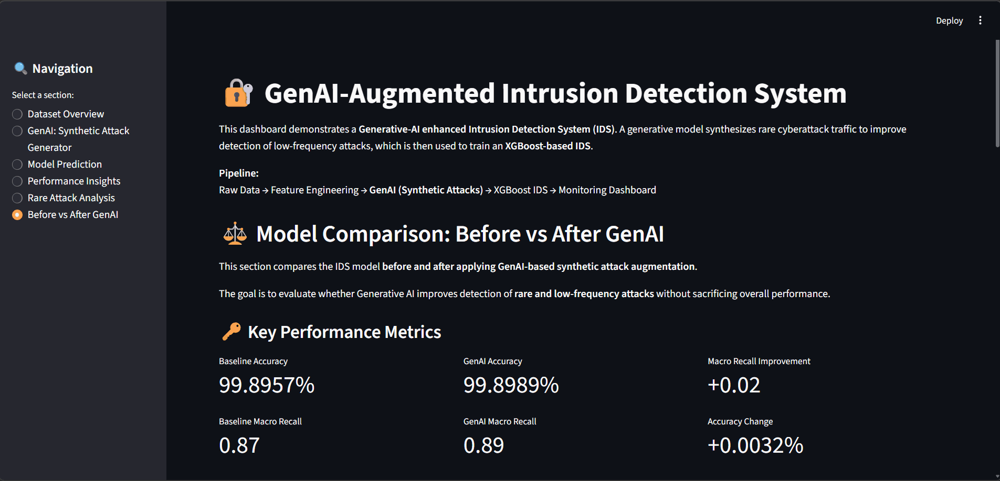

# 🔐 GenAI-Augmented Intrusion Detection System (IDS)

A *machine learning–based network Intrusion Detection System (IDS)* that is later enhanced using Generative AI to improve rare-attack detection.  
The system first classifies network traffic using an *XGBoost-based IDS*, and then addresses extreme class imbalance by synthesizing cyberattack traffic using deep generative models.  
It includes an interactive Streamlit dashboard with confidence scoring, attack severity, batch inference, and SHAP-based explainability.

---

## 🚀 Project Motivation

Traditional IDS models suffer from extreme class imbalance, where rare but dangerous attacks such as:

- Infiltration  
- Heartbleed  
- Web Attacks (XSS, SQL Injection)  

are underrepresented in training data, leading to poor detection performance even in high-accuracy systems.

This project was developed in *two stages*:

1. *Core IDS:* A complete multi-class Intrusion Detection System built using XGBoost  
2. *GenAI Enhancement:* A Generative AI module (VAE) added to improve detection of rare attacks  

Specifically, the system:
- Builds a strong baseline IDS using XGBoost  
- Uses Generative AI (VAE) to synthesize realistic rare-attack samples  
- Augments the training dataset  
- Retrains the IDS for better rare-attack recall  
- Provides model explainability via SHAP  

---

## 🧠 System Architecture

Pipeline:

Raw Network Data  
→ Feature Engineering  
→ *Baseline IDS (XGBoost)*  
→ GenAI (VAE Synthetic Attack Generation)  
→ *Retrained XGBoost IDS*  
→ Explainable Monitoring Dashboard (Streamlit + SHAP)  

---

## 🔬 Before vs After GenAI: Model Comparison

To evaluate the impact of Generative AI–based data augmentation, two IDS models were trained:

- Baseline IDS: XGBoost trained on the original dataset only  
- GenAI-Augmented IDS: XGBoost retrained using synthetic rare-attack samples generated via VAE  

### 📊 Performance Comparison

| Metric | Baseline IDS | GenAI-Augmented IDS |
|--------|--------------|--------------------|
| Overall Accuracy | 99.89% | 99.90% |
| Macro Avg Recall | 0.87 | 0.89 |
| Infiltration Recall | 0.57 | 0.99 |
| Heartbleed Recall | 1.00 | 1.00 |
| XSS Recall | 0.35 | 0.22 |
| SQL Injection Recall | 0.50 | 0.50 |

### ✅ Key Takeaway

The baseline IDS already achieves high accuracy, but struggles with rare cyberattacks.  
After integrating *GenAI-based synthetic data generation, the system significantly improves detection of *low-frequency, high-risk attacks without sacrificing overall performance.

---

## 🖥 Features

- 🔍 Single-Sample Prediction with confidence scores  
- 🚨 Attack Severity Classification (Low / Medium / High)  
- 📂 Batch Inference via CSV Upload  
- 🧠 Explainable AI using SHAP (Top feature contributions)  
- 📈 Before vs After GenAI Performance Comparison  
- 📊 Class-wise Metrics & Visualization  

---

## 🧬 Generative AI Component

After building the baseline IDS, rare attacks were synthetically generated using a Variational Autoencoder (VAE) trained on underrepresented attack classes:

- Infiltration  
- Heartbleed  

These synthetic samples are combined with the original dataset to retrain the IDS model, allowing it to learn more robust decision boundaries for rare cyberattacks.

---

## 🖥 Interactive Dashboard Preview

The IDS is deployed as a real-time, interactive *Streamlit dashboard* that allows security analysts to:

- Inspect dataset composition
- Run live attack predictions
- View SHAP-based explainability
- Compare model performance before and after GenAI augmentation

### 📊 Dataset Overview
Displays real vs synthetic traffic and class distribution.


---

### 🤖 Single Traffic Prediction with SHAP Explainability
Demonstrates:
- Live model inference
- Prediction confidence
- Threat severity
- Feature-level SHAP explanation for model decisions  
- CSV upload entry point for batch inference


---

### 🔬 Before vs After GenAI Model Comparison
Shows the impact of Generative AI on rare attack detection.

- Baseline IDS (without GenAI)
- GenAI-Augmented IDS (with VAE-generated synthetic attacks)
- Clear improvement in rare attack recall


---

## 🚀 How to Run the Project

```bash
git clone https://github.com/<your-username>/LLM-IDS
cd LLM-IDS

python -m venv venv
venv\Scripts\activate

pip install -r requirements.txt
streamlit run app.py
```

---

## 🌐 Accessing the Dashboard

Once the application is running, open your browser at:
`http://localhost:8501`

This launches the interactive *Streamlit-based IDS dashboard*.

---

## 📊 Dataset

This project uses a processed network traffic dataset derived from public IDS benchmarks (CIC-IDS style features).

CIC-IDS2017 - [Dataset Download site](https://www.unb.ca/cic/datasets/index.html)

The dataset includes features such as:

- Flow duration  
- Packet statistics  
- TCP flag counts  
- Inter-arrival times  
- Byte and packet ratios  

These engineered features represent both statistical and protocol-level behavior for accurate intrusion detection.

---

## 🧠 Explainability (SHAP)

Each model prediction is accompanied by *SHAP-based feature attribution*, which provides transparency into the decision-making process.

Key capabilities:

- Displays the *top contributing features* for each prediction  
- Highlights which network characteristics influenced classification  
- Helps security analysts understand *why traffic is flagged*  

This ensures the system is not a black box and supports explainable AI in cybersecurity.

---

## 🔮 Future Enhancements

Planned extensions to improve scalability, realism, and deployment:

- Real-time packet ingestion (Wireshark / Zeek integration)  
- GAN-based synthetic traffic generation  
- Online learning for evolving attack patterns  
- REST API deployment using FastAPI  
- Cloud deployment (Docker / Kubernetes)  

---

## 💼 Resume-Ready Project Summary

*GenAI-Augmented Intrusion Detection System (XGBoost + VAE)*  

Designed a Generative-AI enhanced IDS using VAE-based synthetic attack generation to address extreme class imbalance.  
Improved rare-attack recall (*Infiltration: 0.57 → 0.99) while maintaining **99.9% accuracy, and deployed an interactive **Streamlit dashboard* with confidence scoring, threat severity, SHAP explainability, and batch inference.

---

## 📜 License

This project is intended for *educational and research purposes*.

---